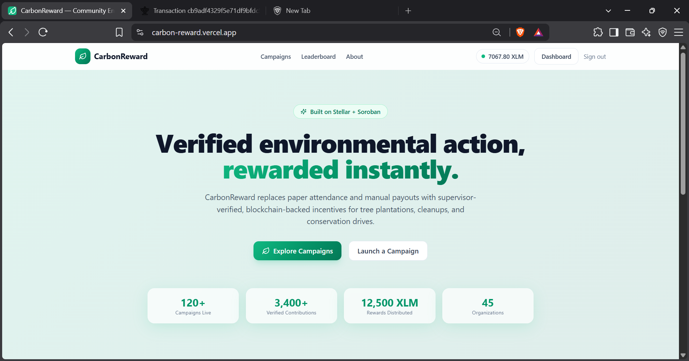
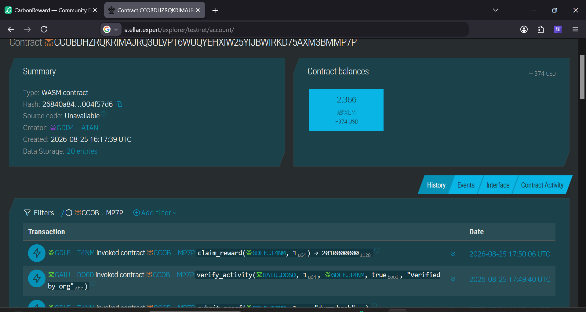

# CarbonReward — Community Environmental Action Platform

> A production-ready Stellar dApp where organizations create environmental campaigns (like tree planting or beach cleanups), participants join and submit proof of work, and supervisors verify it to instantly reward participants with native XLM without middleman fees.

## 🚀 Quick Links
- **Live Platform**: [carbon-reward.vercel.app](https://carbon-reward.vercel.app/)
- **Demo Video**: [Watch Demo on Google Drive](https://drive.google.com/file/d/1Ez6Co0ernqv7O6XftPSS0JY4NIf91yDY/view?usp=sharing)
- **Contract Deployment Address**: `CCOBDHZRQKRIMAJRQ3ULVPT6WUQYEHXIW25YIJBWIRKD75AXM3BMMP7P`
- **Example Successful Transaction (Claim Reward)**: [View on Stellar Expert](https://stellar.expert/explorer/testnet/tx/d9dfbfb868039e69470fcb1f0dcb85475b9a9f07e848721a18c8889c6e6f3785)
- **User Feedback Form**: [CarbonReward Beta Testing Form](https://docs.google.com/forms/d/e/1FAIpQLSdy9GCldotMFx6O7PuazOmqexL8BBFinqcjeeGKoTVzIu730w/viewform?usp=dialog)
- **User Feedback Responses**: [Feedback Data Sheet](https://docs.google.com/spreadsheets/d/1LtJ3cbLrWwbaCOukuA0eQaoWDMuS9WJOLyEwm9YabXw/edit?usp=sharing)

---

## Why this exists

Local communities and environmental organizations often struggle to incentivize direct action. While people want to help clean beaches, plant trees, or maintain trails, volunteer rates remain low because organizations lack a transparent, trustless way to reward participants instantly.

Participants, on the other hand, don't trust promises of future rewards or complex, opaque points systems that take months to cash out.

---

## 📸 Product Screenshots

### Product UI (Homepage)


### Mobile Responsive Design


### Analytics & Monitoring


---

## 👥 Users Onboarded & Feedback

| User ID | Name | Email | Wallet Address | Role | Feedback Summary |
|---------|------|-------|----------------|------|------------------|
| 1 | Saranya Sa | saranyasa999@gmail.com | GCF6G3353E7SY6R2KJX47KUO7N22JJ43SP7CIS6TS3DAIRG6HT5OMW7G | Participant |  site disconnected my Freighter wallet every time I refreshed the page |
| 2 | Ashok Tiwari | ashoktiwari9955@gmail.com | GAIU57CCHT7EBNG2ISWV3F3CLRIUQ32GVIZQFPV75DY6TMTFXTYZDO6D | Participant | You should add a loading spinner during the image upload process so users know it's working. |
| 3 | Sunil Ghosh | 78sunilghosh@gmail.com | GAJ6DFDIPN7SOETR3YSS5N4BEZNRYVSRJFXZ4M7QFXEFDIS5CGVSZPUS | Participant | Got a weird fee error because my wallet balance was zero when I tried to claim |
| 4 | Rajesh Sen | rajeshsen0@gmail.com | GDBZMAZPNCNHOUKAOGMAMX6KCOFWI6DBKZCSGNAG5YMZUJIZ2OK6L2NQ | Organization | Please add a batch approve feature! It takes way too long to approve 50 proofs individually |
| 5 | Kiran Malhotra | kiranmalhotr12a@gmail.com | GAJDDQFE2KL3PYWMMTXK73DNCSSMGZAUDLSMZPIX6OKT6OUJCU3Y2QQP | Participant | blockchain is slow so I double clicked claim and got an error. You could disable the button while it's processing |
| 6 | Shant Arav | shantanav7@gmail.com | GARG5YK76WWI54DLNKK32AYJDGJXQYTU3DPNWZ65LSG7U3LOW2QYRCIK | Participant | I joined a campaign only to realize it was already full. It would be super helpful to show a 'Full' badge on the homepage cards |
| 7 | Simmi tiwari | simmitiwari770@gmail.com | GC4OCMCR57262JVD4VAUCAZH56TVDUFIVIXQK2VCMOYU3SKICPWR24JH | Organization | There is no way to tell a user why I rejected their proof. Suggest adding a text box for rejection reasons |
| 8 |  soham patil |  sohamrpatil4220@gmail.com | GDOF4FEJ3TSK77TG24APQ3Q6X2WHM6N76LLTMX5TSBAS2R5FJBXSNM2L | Participant | Add a dashboard to track total lifetime impact and rewards earned |
| 9 | JAYANT VAIBHAV | jayantvaibhavspj@gmail.com | GAW2TZETZNJ6JRMJQNEXRCZ54Z2MRW7YKHGUB2FVYAJ7OEMMT42BLNPW | Participant | My leftover XLM got stuck in the smart contract when the campaign ended early with fewer participants |
| 10 | Rsnjan Mehta | mehtaranjana745@gmail.com | GDAJAKIZCUOGKMEWMP4WJ2ENHJKJM6HS7U7DOLV6T6FYGRHTER7RT4Z5 | Participant | I'm not familiar with crypto so I didn't know what 50 XLM meant. A tooltip showing the USD equivalent would be great |
| 11 | Akash Mondal | 73akash58mondal@gmail.com  | GDLEUUZIMYT2ZHLJOPBEFOT4YNPGVKHMH65RHPZCL2VCO6WOEULUT4NM | Participant | Include category filters (like 'Tree Planting' vs 'Recycling') to make browsing easier |

---

## 🛠️ Feedback Implementation & Improvements

| User ID | Name | Email | Wallet Address | Feedback Summary | Improvement Made | Git Commit ID |
|---------|------|-------|----------------|------------------|------------------|---------------|
| 1 | Saranya Sa | saranyasa999@gmail.com | GCF6G3353E7SY6R2KJX47KUO7N22JJ43SP7CIS6TS3DAIRG6HT5OMW7G |  site disconnected my Freighter wallet every time I refreshed the page | Allowed wallet disconnection gracefully | [b8a631e](https://github.com/manshi-mehta776/CarbonReward/commit/b8a631e) |
| 3 | Sunil Ghosh | 78sunilghosh@gmail.com | GAJ6DFDIPN7SOETR3YSS5N4BEZNRYVSRJFXZ4M7QFXEFDIS5CGVSZPUS | Got a weird fee error because my wallet balance was zero when I tried to claim | Added Faucet link for zero balance | [96b69fc](https://github.com/manshi-mehta776/CarbonReward/commit/96b69fc) |
| 5 | Kiran Malhotra | kiranmalhotr12a@gmail.com | GAJDDQFE2KL3PYWMMTXK73DNCSSMGZAUDLSMZPIX6OKT6OUJCU3Y2QQP | blockchain is slow so I double clicked claim and got an error. You could disable the button while it's processing | Disabled Claim button during tx | [b870d81](https://github.com/manshi-mehta776/CarbonReward/commit/b870d81) |
| 6 | Shant Arav | shantanav7@gmail.com | GARG5YK76WWI54DLNKK32AYJDGJXQYTU3DPNWZ65LSG7U3LOW2QYRCIK | I joined a campaign only to realize it was already full. It would be super helpful to show a 'Full' badge on the homepage cards | Added "Full" badge to cards | [05796be](https://github.com/manshi-mehta776/CarbonReward/commit/05796be) |
| 7 | Simmi tiwari | simmitiwari770@gmail.com | GC4OCMCR57262JVD4VAUCAZH56TVDUFIVIXQK2VCMOYU3SKICPWR24JH | There is no way to tell a user why I rejected their proof. Suggest adding a text box for rejection reasons | Added rejection reason prompt | [3761275](https://github.com/manshi-mehta776/CarbonReward/commit/3761275) |

---

## 🔗 Proof of Transaction

| Name | Wallet Address | Role | Transaction Link |
|------|----------------|------|------------------|
| Saranya Sa | GCF6G3353E7SY6R2KJX47KUO7N22JJ43SP7CIS6TS3DAIRG6HT5OMW7G | Participant | [View Tx](https://stellar.expert/explorer/testnet/tx/d9dfbfb868039e69470fcb1f0dcb85475b9a9f07e848721a18c8889c6e6f3785) |
| Ashok Tiwari | GAIU57CCHT7EBNG2ISWV3F3CLRIUQ32GVIZQFPV75DY6TMTFXTYZDO6D | Participant | [View Tx](https://stellar.expert/explorer/testnet/tx/cb9adf4329f5e71df9bfdc5c7e9af19388fd64b6e7240c0d35045ecf650850e7) |
| Sunil Ghosh | GAJ6DFDIPN7SOETR3YSS5N4BEZNRYVSRJFXZ4M7QFXEFDIS5CGVSZPUS | Participant | [View Tx](https://stellar.expert/explorer/testnet/tx/bddb94ecae19adfe33076b1589f7ee97f1b635e98d0d8fc4189344f7bce3e733) |
| Rajesh Sen | GDBZMAZPNCNHOUKAOGMAMX6KCOFWI6DBKZCSGNAG5YMZUJIZ2OK6L2NQ | Organization | [View Tx](https://stellar.expert/explorer/testnet/tx/b0b82d5e9b5732943d2338247cac59e9fd84f02e588bc2b10431856f43b8d7e4) |
| Kiran Malhotra | GAJDDQFE2KL3PYWMMTXK73DNCSSMGZAUDLSMZPIX6OKT6OUJCU3Y2QQP | Participant | [View Tx](https://stellar.expert/explorer/testnet/tx/a9017479dc691f64f5f106863f909c275bf32a0b5f548e6cb92ed6fd7635f458) |
| Shant Arav | GARG5YK76WWI54DLNKK32AYJDGJXQYTU3DPNWZ65LSG7U3LOW2QYRCIK | Participant | [View Tx](https://stellar.expert/explorer/testnet/tx/bd845893fe51c102840305379c53012bf85068e4c2a467c0ade77421fc680982) |
| Simmi tiwari | GC4OCMCR57262JVD4VAUCAZH56TVDUFIVIXQK2VCMOYU3SKICPWR24JH | Organization | [View Tx](https://stellar.expert/explorer/testnet/tx/0284ba53bbfad0513b84eb61c428801f59c3fd4676a66b07d07b8e08e520b2aa) |
|  soham patil | GDOF4FEJ3TSK77TG24APQ3Q6X2WHM6N76LLTMX5TSBAS2R5FJBXSNM2L | Participant | [View Tx](https://stellar.expert/explorer/testnet/tx/9356ffb5e64ef4f9c495ae299a869929a0ed3ad1b3727c861501a7f52d8a35a3) |
| JAYANT VAIBHAV | GAW2TZETZNJ6JRMJQNEXRCZ54Z2MRW7YKHGUB2FVYAJ7OEMMT42BLNPW | Participant | [View Tx](https://stellar.expert/explorer/testnet/tx/4d20f9485fb53c9576db579c0d519bbe0cbb2c9d3215fdf2c1008d38a1505d31) |
| Rsnjan Mehta | GDAJAKIZCUOGKMEWMP4WJ2ENHJKJM6HS7U7DOLV6T6FYGRHTER7RT4Z5 | Participant | [View Tx](https://stellar.expert/explorer/testnet/tx/d4b39a6c94f4038e5deeae37f5fd9608f5fb1105b6f4578df94503f0a8d2d769) |
| Akash Mondal | GDLEUUZIMYT2ZHLJOPBEFOT4YNPGVKHMH65RHPZCL2VCO6WOEULUT4NM | Participant | [View Tx](https://stellar.expert/explorer/testnet/tx/2473ff41bda79dcc6b59670321a4c9092cdfb2faf475d782add4c455c824413e) |


CarbonReward solves this by natively locking XLM rewards into a smart contract that releases instantly upon verification. Organizations deposit XLM when creating a campaign. Users participate, submit proof of their work, and once the organization supervisor approves it, the user claims their XLM from the smart contract peer-to-peer. It's fast, completely transparent, and provides on-chain verifiable proof of environmental impact.

## How money actually moves

```
   Organization                                      Participant
       │  createCampaign()                              ▲
       ▼                                                │  claimReward()
┌──────────────────────┐                                │ 
│ Stellar Testnet      │  native XLM transfer           │
│ (Soroban Contract)   │                                │
└──────────────────────┘                                │
       │  transaction settles                           │
       └────────────────────────────────────────────────┘
```

- **Organization → Contract**: `createCampaign()` pulls XLM from the organization's Freighter wallet, executing a native Stellar payment operation to lock the funds in the Soroban smart contract.
- **Contract → Participant**: Once the participant's proof is verified by the organization, `claimReward()` allows the participant to pull their exact reward amount directly from the smart contract. 
- Every interaction produces a real `txHash` you can look up on [stellar.expert](https://stellar.expert/explorer/testnet).

## Architecture

```
frontend/   React + Vite + Tailwind CSS — responsive dashboards for orgs and participants
backend/    Node.js + Express + MongoDB — auth, campaign generation, proof verification API
contracts/  Soroban (Rust) — smart contract for holding and distributing XLM
```

| Layer | Tech |
|---|---|
| Frontend | React + Vite + Tailwind CSS |
| Backend | Node.js + Express |
| Database | MongoDB Atlas |
| Wallet | Freighter |
| Blockchain | Stellar Testnet |
| Smart Contract | Soroban (Rust) |
| Deployment | Vercel (frontend) + Render (backend) |


## ✅ Level 4 Submission Checklist

- [x] **Production MVP (Testnet/Mainnet)**: Deployed to Vercel (frontend) and Render (backend) with Soroban contracts on Stellar Testnet.
- [x] **10+ real users interacting with the dApp**: 11 beta testers onboarded (see table above).
- [x] **Responsive & polished UI**: Fully responsive Tailwind CSS design.
- [x] **Proper error handling & edge cases**: Implemented graceful wallet disconnects, zero-balance faucet warnings, and prevented double-clicking during pending transactions.
- [x] **Demo video walkthrough**: Linked in the Quick Links section.
- [x] **At least 15+ meaningful commits**: Active repository with granular feature commits.
- [x] **README with complete documentation**: Comprehensive architecture, feedback tables, and workflow documented.
- [x] **User Feedback collection & summary**: 11 user responses collected, summarized in USER_FEEDBACK_SUMMARY.md, with 5 direct improvements implemented.
- [x] **Contract deployment address**: CCOBDHZRQKRIMAJRQ3ULVPT6WUQYEHXIW25YIJBWIRKD75AXM3BMMP7P
- [x] **Screenshots showing**:
  - [x] Product UI
  - [x] Mobile responsive design
  - [x] Analytics or monitoring setup
- [x] **Proof of 10+ user wallet interactions**: Documented in the Proof of Transaction table with direct Stellar Expert links.
