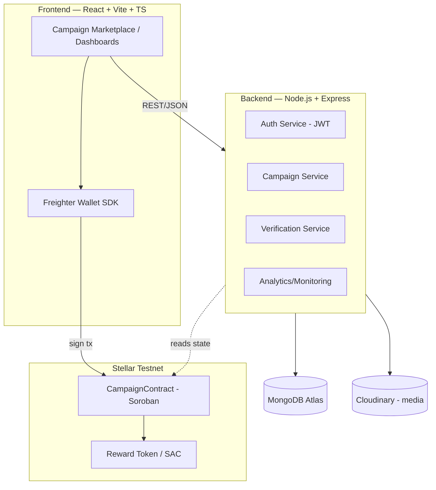
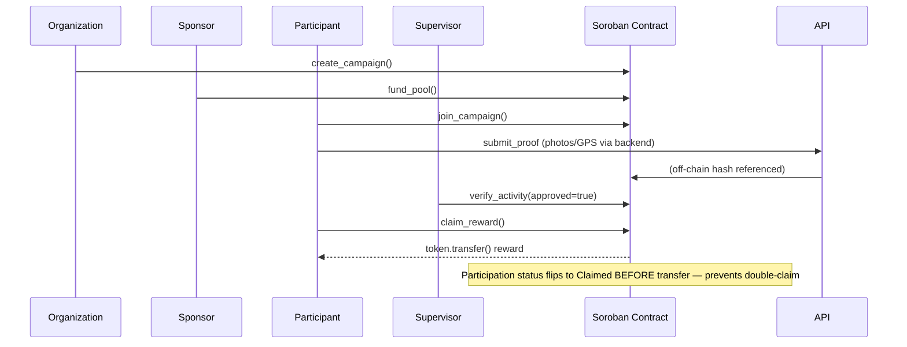
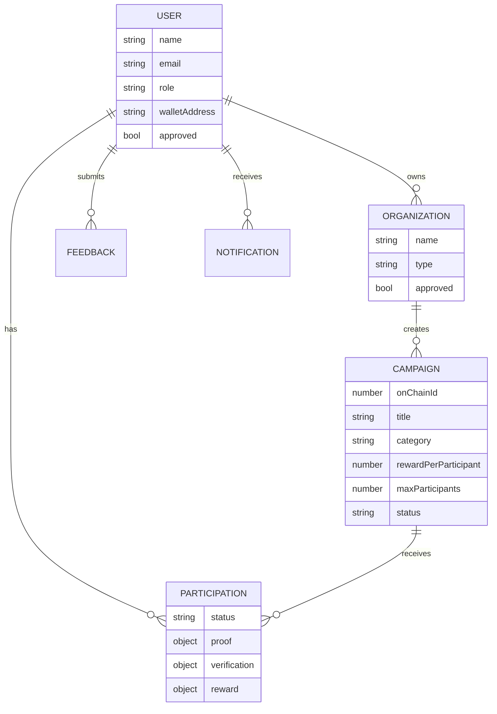

# 🌱 CarbonReward

**Community Environmental Incentive Platform — built on Stellar + Soroban**

CarbonReward lets schools, universities, NGOs, municipalities, government agencies and CSR
programs create environmental campaigns (tree plantations, river cleanups, plastic collection,
beach cleanups, recycling drives...) where community participation is verified by supervisors and
rewarded automatically through Soroban smart contracts — no paper attendance, no manual payouts,
no duplicate claims.

> **Status:** This repository is a full, working scaffold — smart contract, API, and frontend are
> implemented end-to-end. Before it satisfies every Level 4 submission item you still need to:
> deploy the contract to Testnet, provision MongoDB Atlas/hosting, onboard your 10 real users, and
> record the demo video. See [Remaining Work](#remaining-work-before-submission) at the bottom.

---

## Table of Contents

1. [Architecture](#architecture)
2. [Blockchain Flow](#blockchain-flow)
3. [Repository Structure](#repository-structure)
4. [Tech Stack](#tech-stack)
5. [Database Schema](#database-schema)
6. [Smart Contract](#smart-contract)
7. [API Reference](#api-reference)
8. [Local Development](#local-development)
9. [Environment Variables](#environment-variables)
10. [Deployment Guide](#deployment-guide)
11. [Security](#security)
12. [Analytics & Monitoring](#analytics--monitoring)
13. [Testing](#testing)
14. [Remaining Work Before Submission](#remaining-work-before-submission)

---

## Architecture



**Design principle:** on-chain state is the source of truth for anything money-related
(reward eligibility, claims, double-claim prevention). MongoDB is a fast, queryable mirror for
dashboards, search, notifications and analytics — it is never trusted for authorization decisions.

## Blockchain Flow



## Repository Structure

```
carbon-reward/
├── contracts/                 # Soroban smart contract workspace (Rust)
│   └── campaign-contract/
│       ├── src/lib.rs         # Campaign, funding, verification, claim logic
│       └── src/test.rs        # Unit tests (happy path, double-claim, auth)
├── backend/                   # Express + TypeScript REST API
│   └── src/
│       ├── config/            # env validation, db, logger, sentry, analytics
│       ├── models/             # Mongoose schemas
│       ├── controllers/        # route handlers
│       ├── routes/             # Express routers
│       └── middleware/         # auth, validation, rate limiting, errors
├── frontend/                  # React + Vite + TS + Tailwind SPA
│   └── src/
│       ├── pages/               # Landing, Marketplace, Dashboards, Auth
│       ├── components/          # Navbar, CampaignCard, ProtectedRoute
│       ├── lib/                 # api client, Freighter wallet wrapper, analytics
│       └── store/                # zustand auth store
├── .github/workflows/ci.yml   # CI: contract tests, backend tests, frontend build
└── docs/                      # additional diagrams / submission assets
```

## Tech Stack

| Layer      | Technology |
|------------|------------|
| Frontend   | React, Vite, TypeScript, Tailwind CSS, React Router, TanStack Query, React Hook Form, Zod, Framer Motion, Zustand |
| Wallet     | Freighter API, Stellar SDK |
| Backend    | Node.js, Express, TypeScript, Mongoose, JWT, Helmet, express-rate-limit, Pino, Zod |
| Blockchain | Soroban (Rust), Stellar Testnet |
| Data       | MongoDB Atlas |
| Media      | Cloudinary |
| Monitoring | Sentry |
| Analytics  | PostHog |
| Deployment | Vercel (frontend), Render (backend), MongoDB Atlas |

## Database Schema



Full Mongoose schemas: [`backend/src/models`](./backend/src/models).

## Smart Contract

`contracts/campaign-contract/src/lib.rs` — a single Soroban contract managing the full campaign
lifecycle:

| Function | Caller | Purpose |
|---|---|---|
| `initialize` | admin | one-time setup |
| `approve_supervisor` | admin | whitelist a wallet allowed to verify proofs |
| `create_campaign` | organization | register a campaign + reward-per-participant |
| `fund_pool` | organization/sponsor | transfer reward tokens into the contract |
| `join_campaign` | participant | register participation (one per wallet, enforced by storage key) |
| `submit_proof` | participant | attach an off-chain content hash of proof media |
| `verify_activity` | approved supervisor | approve/reject, with comment |
| `claim_reward` | participant | flips status to `Claimed` **before** transferring tokens, so a second call always fails with `AlreadyClaimed` |
| `close_campaign` | organization | stop new joins/claims |
| `get_campaign` / `get_participation` / `list_participants` | anyone | read-only views |

**Fraud/double-claim protection:** each `(campaign_id, participant)` pair maps to one
`Participation` record in persistent storage. State transitions are strictly ordered
(`Joined → ProofSubmitted → Verified/Rejected → Claimed`) and `claim_reward` updates storage
*before* calling `token::Client::transfer`, so even a reentrant or racing call cannot double-spend.

Unit tests (`src/test.rs`) cover: happy path, double-claim rejection, double-join rejection,
unapproved-supervisor rejection, claim-without-verification rejection, and insufficient-pool
rejection.

### Deploying the contract (you will need to run this yourself with your Stellar keys)

```bash
cd contracts
rustup target add wasm32-unknown-unknown
cargo build --target wasm32-unknown-unknown --release -p campaign-contract

soroban contract deploy \
  --wasm target/wasm32-unknown-unknown/release/campaign_contract.wasm \
  --source <your-testnet-key> \
  --network testnet

# Save the returned contract ID into backend/.env (CAMPAIGN_CONTRACT_ID)
# and frontend/.env (VITE_CAMPAIGN_CONTRACT_ID)
```

## API Reference

Base URL: `/api`. All protected routes require `Authorization: Bearer <jwt>`.

| Method | Route | Auth | Description |
|---|---|---|---|
| POST | `/auth/register` | — | Create account |
| POST | `/auth/login` | — | Get JWT |
| GET  | `/auth/me` | ✔ | Current user |
| POST | `/auth/wallet` | ✔ | Link Freighter wallet address |
| GET  | `/campaigns` | — | List/search/filter campaigns |
| GET  | `/campaigns/:id` | — | Campaign details |
| POST | `/campaigns` | organization | Create campaign |
| POST | `/campaigns/:id/close` | organization | Close campaign |
| POST | `/campaigns/:campaignId/join` | participant | Join campaign |
| POST | `/campaigns/:campaignId/proof` | participant | Submit proof (media URLs, GPS, hash) |
| GET  | `/campaigns/me/participations` | participant | My campaign history |
| GET  | `/participations/pending` | supervisor | Queue of proofs to verify |
| POST | `/participations/:id/verify` | supervisor | Approve/reject with comment |
| POST | `/participations/:id/claim` | participant | Record an on-chain claim tx hash |
| POST | `/organizations` | organization | Register an organization (pending admin approval) |
| GET  | `/organizations/me` | organization | My organizations |
| POST | `/organizations/:id/supervisors` | organization | Approve a supervisor for the org |
| GET  | `/organizations/:id/analytics` | organization | Campaign/participation stats |
| GET  | `/admin/users` | admin | List/filter users |
| POST | `/admin/organizations/:id/approve` | admin | Approve organization |
| POST | `/admin/users/:id/approve-supervisor` | admin | Approve a supervisor |
| GET  | `/admin/feedback` | admin | Feedback dashboard |
| GET  | `/admin/health` | admin | System health/usage counts |
| POST | `/feedback` | any authenticated | Submit feedback |
| GET  | `/leaderboard` | — | Top participants |

Every response follows `{ success: boolean, data?: ..., message?: string, meta?: ... }`.

## Local Development

```bash
# 1. Contract (optional for local API/frontend work)
cd contracts && cargo test

# 2. Backend
cd backend
cp .env.example .env    # fill in MONGODB_URI and JWT_SECRET at minimum
npm install
npm run dev              # http://localhost:4000

# 3. Frontend
cd frontend
cp .env.example .env
npm install
npm run dev               # http://localhost:5173
```

You'll need a MongoDB instance — either a free [MongoDB Atlas](https://www.mongodb.com/atlas)
cluster or a local `mongod`. Freighter (browser extension) is required to exercise wallet flows.

## Environment Variables

See [`backend/.env.example`](./backend/.env.example) and [`frontend/.env.example`](./frontend/.env.example)
for the full list. Backend env vars are validated at boot with Zod (`src/config/env.ts`) — the
process exits immediately with a clear error if something required is missing, rather than failing
confusingly mid-request.

## Deployment Guide

| Component | Recommended host | Notes |
|---|---|---|
| Frontend | Vercel | Set `VITE_API_URL` to your deployed backend URL |
| Backend | Render (Web Service) | Set all vars from `.env.example`; enable auto-deploy from `main` |
| Database | MongoDB Atlas | Free M0 tier is sufficient for the MVP; whitelist Render's IP or `0.0.0.0/0` for the demo |
| Contract | Stellar Testnet | Deploy via `soroban contract deploy` (see above), record the contract ID in the README's placeholder |

## Security

- JWT auth; identity is always derived from the verified token, never trusted from the request body.
- `bcryptjs` password hashing (cost factor 12).
- Zod validation on every mutating route.
- `helmet` HTTP headers, CORS locked to `CLIENT_ORIGIN`.
- Two-tier rate limiting: global API limiter + a stricter limiter on `/auth/*`.
- Role-based route guards (`requireRole`) — e.g. only `organization` can create campaigns, only
  `supervisor` can verify.
- Wallet-to-account binding is unique (one wallet cannot back multiple accounts).
- Reward-claim double-spend is enforced **on-chain** (see Smart Contract section) — the backend's
  `claimTxHash` record is a mirror for dashboards, not the authorization boundary.
- Environment variables are schema-validated at startup; the app refuses to boot with an invalid config.

## Analytics & Monitoring

**PostHog** events (`backend/src/config/analytics.ts`, `frontend/src/lib/analytics.ts`):
`user_registered`, `wallet_connected`, `campaign_created`, `campaign_joined`, `proof_uploaded`,
`verification_completed`, `reward_claimed`, `feedback_submitted`.

**Sentry**: initialized in both backend (`config/sentry.ts`) and frontend (wire up
`@sentry/react` in `main.tsx` with your DSN) to capture unhandled errors, failed API calls, and
wallet/RPC failures.

## Testing

- **Contract:** `cargo test` inside `contracts/` — happy path, double-claim, double-join,
  unapproved-supervisor, unverified-claim, insufficient-pool, timestamp correctness.
- **Backend:** `npm test` inside `backend/` (Vitest + Supertest) — extend `src/__tests__` with
  integration tests per route using `mongodb-memory-server` for a real but ephemeral DB.
- **Frontend:** `npm test` inside `frontend/` (Vitest) — add component/unit tests as pages are finalized.
- **CI:** `.github/workflows/ci.yml` runs all three on every push/PR to `main`.

## Remaining Work Before Submission

This scaffold gives you a real, running product locally. To satisfy every Level 4 checklist item
you still need to, in roughly this order:

1. `npm install` in `backend/` and `frontend/`, provision a MongoDB Atlas cluster, and confirm both run locally end-to-end.
2. Deploy the Soroban contract to Testnet and wire the returned contract ID into both `.env` files; implement the frontend's actual `submit()`/`invoke` calls against it (the wallet helper and contract are ready — the transaction-building glue in `CampaignDetails`/dashboard pages is the next piece to fill in with `@stellar/stellar-sdk`'s `Contract`/`TransactionBuilder`).
3. Deploy backend to Render and frontend to Vercel; connect Sentry + PostHog with real keys.
4. Onboard 10 real users (participants + at least one org/supervisor), have them connect Freighter and complete a full join → verify → claim cycle — screenshot each step for submission.
5. Collect feedback via the in-app `/feedback` endpoint (build a small feedback form page/route if you want a dedicated UI — the API is ready).
6. Write your architecture write-up/demo video, capture mobile-responsive screenshots, and fill in the contract-address placeholder above.
7. Make 15+ meaningful, incremental commits as you do all of the above rather than one large commit — this repo is intentionally organized by phase (contract → backend → frontend → integration) to make that natural.
